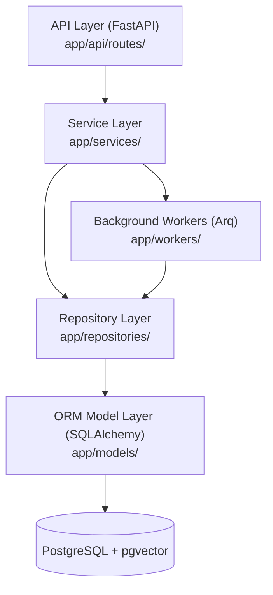
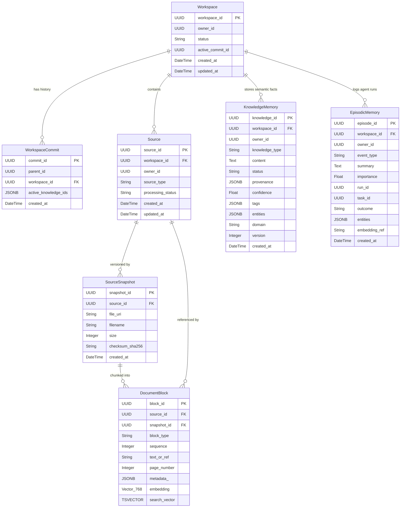

# NeosisLM: Model Architecture, File Relationships & Graphify Map

> **LLM Context Document**: This document provides an exhaustive, single-source-of-truth breakdown of NeosisLM's database models, file architecture, cross-layer dependency graph, and Graphify knowledge-graph metrics. It is formatted for direct ingestion by large language models (Claude, ChatGPT, Gemini, etc.).

---

## 1. System Architecture Overview

NeosisLM is an AI-native workspace knowledge and research system. It ingests documents, creates semantic vector embeddings and full-text search indices, extracts structured knowledge and episodic interaction memories, and orchestrates hybrid retrieval with asynchronous background workers.



---

## 2. Core Model Layer (`app/models/`)

The database models live in `app/models/` and inherit from `app.core.database.Base` (SQLAlchemy declarative base).

### Entity Summary Table

| Model | Table Name | Primary Key | Foreign Keys | Key Columns / Indices |
|---|---|---|---|---|
| **`Workspace`** | `workspaces` | `workspace_id` (UUID) | None | `owner_id`, `status`, `active_commit_id`, timestamps |
| **`WorkspaceCommit`** | `workspace_commits` | `commit_id` (UUID) | `workspace_id` → `workspaces.workspace_id` (CASCADE) | `parent_id`, `active_knowledge_ids` (JSONB) |
| **`Source`** | `sources` | `source_id` (UUID) | `workspace_id` → `workspaces.workspace_id` (CASCADE) | `owner_id`, `source_type`, `processing_status` (`pending`, `processing`, `completed`, `failed`) |
| **`SourceSnapshot`** | `source_snapshots` | `snapshot_id` (UUID) | `source_id` → `sources.source_id` (CASCADE) | `file_uri`, `filename`, `size`, `checksum_sha256` |
| **`DocumentBlock`** | `document_blocks` | `block_id` (UUID) | `source_id` → `sources.source_id`<br/>`snapshot_id` → `source_snapshots.snapshot_id` | `embedding` (Vector 768, HNSW cosine)<br/>`search_vector` (TSVECTOR, GIN)<br/>`text_or_ref`, `page_number`, `metadata_` (JSONB) |
| **`KnowledgeMemory`** | `knowledge_memories` | `knowledge_id` (UUID) | `workspace_id` → `workspaces.workspace_id` (CASCADE) | `owner_id`, `knowledge_type`, `content`, `status`, `confidence`, `entities` (JSONB), `provenance` (JSONB) |
| **`EpisodicMemory`** | `episodic_memories` | `episode_id` (UUID) | `workspace_id` → `workspaces.workspace_id` (CASCADE) | `owner_id`, `run_id`, `task_id`, `event_type`, `summary`, `outcome`, `importance` |

---

## 3. Entity-Relationship Diagram (ERD)



---

## 4. Cross-Layer File Connections

Each model in `app/models/` is connected vertically through the system architecture:

```
[API Endpoint]  (app/api/routes/)
      │
      ▼
  [Service]     (app/services/)  ◄───►  [Worker Jobs] (app/workers/tasks.py)
      │
      ▼
 [Repository]   (app/repositories/)
      │
      ▼
   [Model]      (app/models/)    ◄───►  [Pydantic Schema] (app/schemas/)
      │
      ▼
 [Database]     (PostgreSQL + pgvector / Neo4j Graph)
```

### 1. Workspace Flow
- **Model**: `app/models/workspace.py` (`Workspace`, `WorkspaceCommit`)
- **Schema**: `app/schemas/workspace.py` (`WorkspaceCreate`, `WorkspaceUpdate`, `WorkspaceResponse`, `CommitResponse`)
- **Repository**: `app/repositories/workspace.py` (`WorkspaceRepository`: `create_workspace`, `get_workspace`, `create_commit`, `set_active_commit`)
- **Service**: 
  - `app/services/quota.py` (`QuotaService`: checks workspace count limits)
  - `app/services/export.py` (`WorkspaceExportService`: dumps workspace state, blocks, and memory into parquet/json zip archives)
- **API**: `app/api/routes/workspaces.py` (CRUD, commit snapshots, rollbacks, export trigger)

### 2. Source & Ingestion Flow
- **Model**: `app/models/source.py` (`Source`, `SourceSnapshot`)
- **Schema**: `app/schemas/source.py`, `app/schemas/file.py`
- **Repository**: `app/repositories/source.py` (`SourceRepository`: manage files, snapshot creation, checksum deduplication)
- **Service**: 
  - `app/services/storage.py` (`S3ObjectStore`: uploads raw files)
  - `app/services/parsing.py` (`ParsingService`: extracts text from PDF/TXT/Markdown)
  - `app/services/chunking.py` (`ChunkingService`: splits text into deterministic document chunks)
- **Worker**: `app/workers/tasks.py` (background file parsing and snapshot ingestion)
- **API**: `app/api/routes/workspaces.py` (`POST /workspaces/{id}/sources/upload`)

### 3. Document Block & Search Flow
- **Model**: `app/models/block.py` (`DocumentBlock`: stores chunks with vector embedding & tsvector)
- **Schema**: `app/schemas/block.py` (`BlockCreate`, `BlockResponse`)
- **Repository**: `app/repositories/block.py` (`BlockRepository`: bulk insert chunks, vector similarity search)
- **Service**: `app/services/hybrid_retrieval.py` (`HybridRetrievalService`: combines Reciprocal Rank Fusion / cosine vector search via HNSW and tsvector full-text search via GIN)
- **API**: `app/api/routes/workspaces.py` (`POST /workspaces/{id}/ask-ground-mode`)

### 4. Knowledge & Graph Flow
- **Model**: `app/models/knowledge.py` (`KnowledgeMemory`)
- **Schema**: `app/schemas/knowledge.py`, `app/schemas/graph.py`
- **Repository**: 
  - `app/repositories/knowledge.py` (`KnowledgeRepository`: SQL persistence)
  - `app/repositories/graph.py` (`GraphRepository`: Neo4j / Knowledge Graph entity-relation sync)
- **Worker**: `app/workers/tasks.py` (`sync_knowledge_to_graph_job`: synchronizes PostgreSQL knowledge entries into the graph)
- **API**: `app/api/routes/workspaces.py` (Knowledge queries, graph sync triggers)

### 5. Episodic Memory Flow
- **Model**: `app/models/episodic.py` (`EpisodicMemory`)
- **Schema**: `app/schemas/episodic.py`
- **Repository**: `app/repositories/episodic.py` (`EpisodicRepository`)
- **Service**: `app/services/episodic.py`, `app/services/memory_router.py` (`MemoryRouter`: selectively activates knowledge facts and past agent run episodes based on user queries)
- **API**: `app/api/routes/workspaces.py` (Agent session execution and memory inspection)

---

## 5. Graphify Knowledge Graph Analysis

Graphify AST analysis extracted the complete dependency structure of the codebase.

### Graph Summary Metrics
- **Total Nodes**: 9,484
- **Total Edges**: 20,564
- **Discovered Communities**: 433
- **Generated Wiki Articles**: 443 Markdown files in `graphify-out/wiki/` (Entrypoint: `graphify-out/wiki/index.md`)

### Key Architecture Communities Discovered

| Community | Major Symbols / Files | Architectural Role |
|---|---|---|
| **Community 34** | `Workspace`, `Source`, `SourceSnapshot`, `DocumentBlock`, `KnowledgeMemory`, `EpisodicMemory`, `database.py`, `export.py` | **Core Persistence & Models**: SQLAlchemy ORM definitions, DB session handling, analytical export bundle generation. |
| **Community 43** | `workspaces.py` (routes), `WorkspaceRepository`, `WorkspaceCommit`, `WorkspaceCreate`, `WorkspaceUpdate` | **Workspace Management & Commits**: API entrypoints and repository operations for workspace lifecycles and commits. |
| **Community 60** | `hybrid_retrieval.py`, `deps/llm.py`, `RetrievedChunk`, `test_ground_mode_api.py` | **Hybrid Search & LLM Gateways**: Dense vector + Sparse full-text retrieval, embedding gateways. |
| **Community 64** | `memory_router.py`, `MemoryRouter`, `ask_ground_mode()` | **Cognitive Routing**: Memory router deciding between episodic interaction recall and structured knowledge facts. |
| **Community 31** | `workers/tasks.py`, `storage.py`, `S3ObjectStore`, `export_workspace_job`, `sync_knowledge_to_graph_job` | **Asynchronous Job Workers**: Arq background task queue, S3 object storage operations, async export and sync. |
| **Community 135**| `quota.py`, `QuotaService`, `test_quota.py` | **Usage & Resource Guardrails**: Workspace, source count, knowledge, and storage quota validation. |

### Major God Nodes (Central Connectors)
Graphify identified the highest-degree nodes that act as communication backbones:
1. **`Workspace`** (`app/models/workspace.py`): Central root entity connected across 108 direct dependency nodes.
2. **`workspaces.py`** (`app/api/routes/workspaces.py`): Primary REST API interface receiving client traffic.
3. **`WorkspaceRepository`** (`app/repositories/workspace.py`): Primary data layer connector.
4. **`MemoryRouter`** (`app/services/memory_router.py`): Primary orchestration engine routing memory to retrieval.
5. **`tasks.py`** (`app/workers/tasks.py`): Background task hub executing asynchronous data transformations.

---

## 6. Prompt Template to Feed to Another LLM

When pasting this context to another LLM (e.g. Claude, GPT-4, etc.), you can prefix it with the following prompt:

```markdown
You are an expert software engineer reviewing the architecture of NeosisLM.
Below is the complete architectural specification, model definitions, file relationships, and Graphify AST analysis:

[PASTE THIS ENTIRE DOCUMENT HERE]

Use this specification as your ground-truth reference for all database schemas, service boundaries, file paths, and component interactions in NeosisLM.
```
