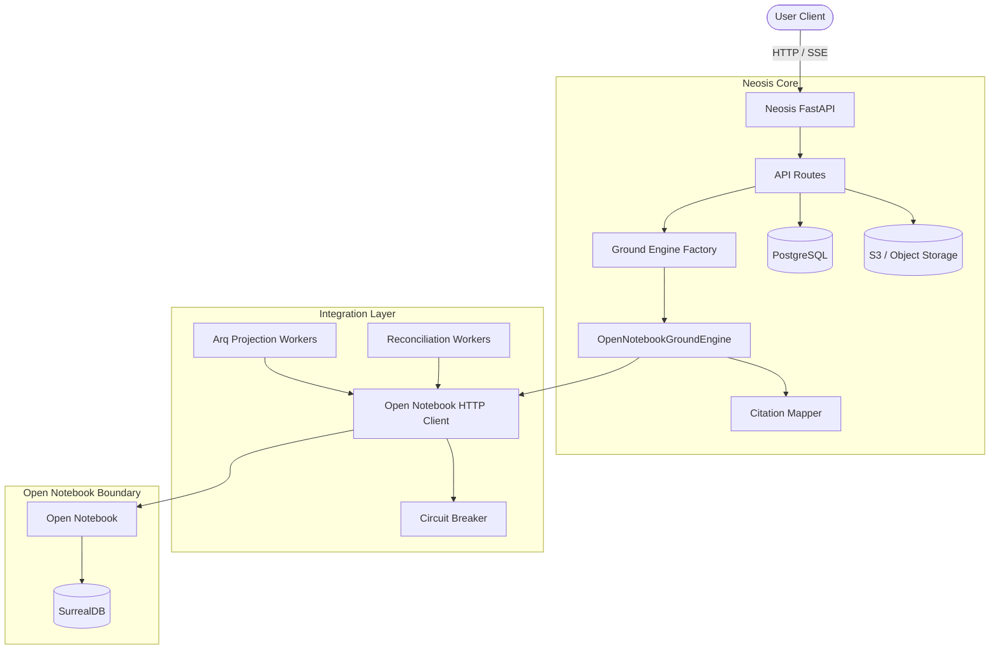
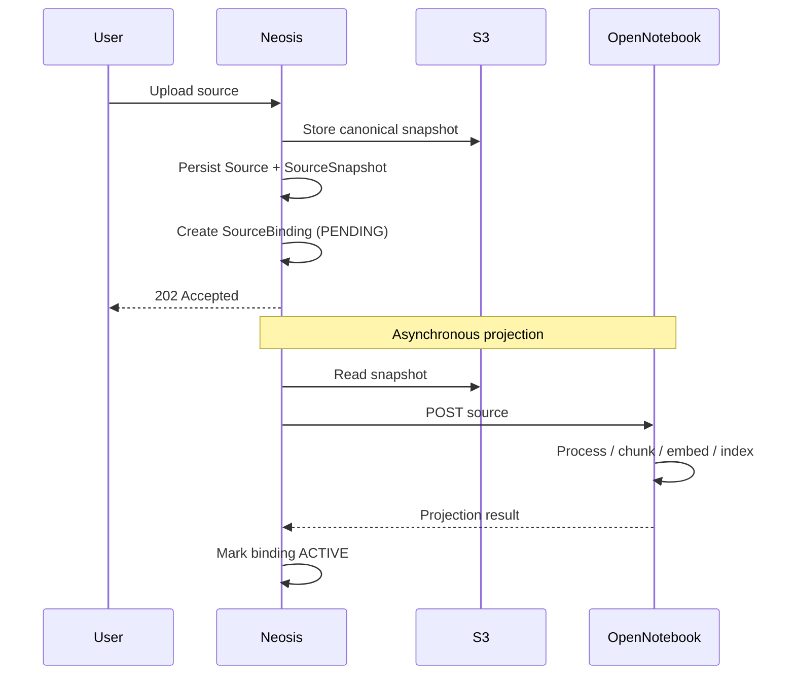

# Open Notebook Ground Integration: Architecture & Operations Guide

This document is the authoritative technical reference for the Open Notebook Ground integration in NeosisLM (Chapter 2).

The integration treats Open Notebook as an internal execution substrate for Ground mode while keeping PostgreSQL, S3, Redis/Arq, and Neosis domain models canonical.

---

## 1. Architecture & Design Principles

1. **Neosis owns the product.** PostgreSQL remains canonical for users, workspaces, permissions, sources, snapshots, conversations, provenance, and lifecycle state.

2. **Open Notebook is an execution dependency.** Open Notebook owns Ground execution internals such as ingestion, retrieval, Ask execution, context construction, and its internal runtime state. It does not own Neosis identity or authorization.

3. **Projection, not delegation.** Canonical Neosis `SourceSnapshot` data is projected asynchronously into Open Notebook. Open Notebook IDs are tracked through explicit bindings and are never treated as Neosis primary keys.

4. **The integration boundary is explicit.** Neosis API routes resolve a Ground engine through the existing engine factory/dependency boundary. The frontend does not contain Open Notebook-specific routing or identifiers.

5. **Failure is explicit.** There is no automatic fallback from Open Notebook to legacy Ground when Open Notebook fails. Rollback is an explicit operator/configuration action.

6. **Canonical state and execution state remain separate.** PostgreSQL defines what exists and what is active. Open Notebook executes Ground against its projected state.

### High-level topology



---

## 2. Core Components

### Ground routing

`app/services/ground/factory.py`

The `get_ground_engine` dependency is the explicit selection boundary for Ground execution.

```text
OPEN_NOTEBOOK_ENABLED=True
    -> OpenNotebookGroundEngine
```

```text
OPEN_NOTEBOOK_ENABLED=False
    -> legacy Ground implementation
```

The route layer should not contain scattered Open Notebook conditionals.

### Open Notebook Ground Engine

`app/integrations/open_notebook/ground_engine.py`

`OpenNotebookGroundEngine` implements the Neosis Ground engine contract and is responsible for validating the applicable Neosis workspace context, invoking Open Notebook through the integration client, translating upstream results into Neosis-owned structures, and keeping Open Notebook-specific IDs out of the public API.

### HTTP client

`app/integrations/open_notebook/client.py`

The client owns the network boundary to Open Notebook and provides connection/request timeouts, retry-aware upstream interaction, circuit breaking, normalized error handling, SSE/event normalization, and correlation-context propagation.

Open Notebook remains an internal dependency; raw upstream errors are not returned directly to API consumers.

### Citation / provenance mapper

`app/integrations/open_notebook/citation_mapper.py`

Open Notebook returns its own source identifiers. These are translated through Neosis bindings back into canonical Neosis `source_id` / evidence references.

The mapper must never expose raw Open Notebook IDs, fabricate citations, or silently convert unmapped evidence into valid canonical provenance.

---

## 3. Data Ingestion: Source Projection

Ground ingestion uses a canonical-source projection model.



Projection is asynchronous and handled through Redis/Arq.

A large upload batch must not create unbounded concurrent requests to Open Notebook. Projection execution is explicitly bounded by the Open Notebook queue/worker concurrency. `429` and transient failures are handled with controlled retry/backoff as a secondary protection mechanism.

### Projection lifecycle

```text
PENDING
   |
   v
ACTIVE
   |
   +----> FAILED / retryable / reconciliation-required
```

Exact state names must remain aligned with the live repository.

`PENDING` means the canonical source exists but its Open Notebook projection is not yet active.

`ACTIVE` means the projection is available to Ground retrieval.

`FAILED` means projection did not complete successfully; the canonical Neosis source remains authoritative.

A newly created snapshot must not remove the old projection until the new projection has been successfully created, linked/activated, and replacement semantics are satisfied.

---

## 4. Workspace, Source, and Conversation Bindings

Neosis maintains explicit mappings between canonical entities and Open Notebook entities.

### Workspace binding

```text
Neosis workspace_id <-> Open Notebook notebook/session scope
```

The Open Notebook identifier is an external binding, not a Neosis foreign key.

### Source binding

A source binding is snapshot-aware:

```text
Neosis source_id
Neosis snapshot_id
        <->
Open Notebook source_id
```

This preserves canonical snapshot semantics even though Open Notebook maintains its own execution state.

### Conversation binding

Ground conversation identity remains canonical to Neosis.

```text
Neosis GroundConversation
        |
        +--> OpenNotebookConversationBinding
                    |
                    +--> Open Notebook session/execution state
```

If Open Notebook session state is lost, Phase 3 semantics require an explicit session-state-lost error. Automatic replay/rehydration is not part of this migration.

---

## 5. Ground Queries, Streaming, and Provenance

### Blocking Ground

The normal Ground endpoint uses the engine factory and returns a Neosis-owned response. The frontend does not need to know which Ground implementation produced it.

### Streaming Ground

The streaming endpoint is:

```text
POST /api/v1/workspaces/{workspace_id}/ask/stream
```

Open Notebook SSE events are consumed internally and normalized to the Neosis streaming contract. Exact event names must follow the live implementation; the contract should contain Neosis-owned lifecycle semantics such as:

```text
answer.started
answer.delta
evidence.updated
answer.completed
answer.error
```

Open Notebook event names must not leak to the frontend.

### Provenance rules

**Full provenance:** all returned evidence maps to valid canonical Neosis evidence; the answer is accepted with complete provenance.

**Partial provenance:** some evidence maps and some does not; the answer may be returned with `provenance_status=partial` and a warning, while unmapped upstream IDs are omitted.

**Zero valid provenance:** no valid canonical evidence can be established; the response is not accepted as a successful Ground answer and a controlled Neosis provenance/grounding error is returned.

The system must never fabricate evidence to make an answer appear grounded.

---

## 6. Error Translation & Security Boundary

Open Notebook is an internal dependency. Raw implementation errors must not cross the Neosis API boundary.

The integration maps upstream failures into stable Neosis domain errors while preserving useful HTTP semantics.

| Condition | Neosis behavior |
|---|---|
| Invalid user/query input | Ground validation error |
| Open Notebook unavailable | Dependency unavailable / 503 |
| Upstream timeout | Dependency timeout / 504 |
| Upstream 5xx | Sanitized Ground/dependency failure |
| Malformed upstream response | Integration/execution failure |
| 429 | Throttling/backpressure response or controlled retry |

Public responses may include a Neosis error code, sanitized message, and Neosis request/correlation identifier.

They must not include Open Notebook tracebacks, SurrealDB errors, internal table/column names, raw upstream identifiers, internal filesystem paths, credentials, or secrets.

Raw diagnostic information belongs in secure internal logs and telemetry.

---

## 7. Reliability: Timeouts, Circuit Breaking, and Backpressure

### Circuit breaker

The Open Notebook client uses:

```text
CLOSED -> OPEN -> HALF_OPEN -> CLOSED
```

Transient dependency failures such as connection errors, timeouts, and 5xx responses can trip the breaker. Deterministic 4xx responses should not normally trip it. `429` is treated primarily as throttling/backpressure rather than proof that the dependency is permanently unavailable.

When the circuit is `OPEN`, requests fail fast with a controlled Neosis dependency error.

### Backpressure

The integration uses:

```text
bounded concurrency
        +
retry/backoff with jitter
        +
circuit breaking
```

Interactive Ground execution must retain capacity even when large projection batches are queued.

---

## 8. Telemetry & Correlation

OpenTelemetry is the primary distributed tracing mechanism.

Explicit Neosis correlation headers supplement OTel so service logs remain searchable even if trace context is fragmented:

```text
traceparent / tracestate
X-Neosis-Run-ID
X-Neosis-Task-ID
X-Neosis-Request-ID
```

These identifiers come from the existing Neosis request/execution context. The Open Notebook client must not generate unrelated identifiers for the same execution.

They must not contain query text, source content, credentials, or other sensitive data.

### Investigation flow

1. Obtain the Neosis request/run identifier from the API request or logs.
2. Inspect Neosis FastAPI/worker logs.
3. Follow the OTel trace where available.
4. Search Open Notebook logs using the propagated Neosis correlation ID.
5. Inspect circuit-breaker, timeout, projection, or provenance events associated with the execution.

---

## 9. Health & Readiness

Health semantics should distinguish between:

- Neosis process health,
- Open Notebook reachability,
- Ground dependency readiness,
- projection backlog,
- reconciliation/deletion backlog.

An unavailable Open Notebook dependency should result in the appropriate degraded/readiness behavior for Ground rather than a false healthy indication.

At the same time, an optional/degraded integration should not unnecessarily disable unrelated Neosis functionality.

Exact readiness behavior must follow the live repository's health architecture.

---

## 10. Cache Safety

Even if a response cache is not currently enabled, Ground cache design must respect canonical workspace state.

A Ground response cache must minimally distinguish:

```text
query_hash
+
workspace_id
+
active_commit_id
```

If result-affecting engine, prompt, or configuration versions are introduced, they must also participate in the cache namespace or invalidation model.

Therefore:

```text
same query
+ same workspace
+ same active commit
= cache candidate

same query
+ same workspace
+ different active commit
= cache miss
```

No cache may return a Ground answer generated against one workspace or canonical state to another.

---

## 11. Deletion & Reconciliation

Canonical deletion never waits synchronously for Open Notebook.

Deletion intent is durable through the Neosis deletion/tombstone mechanism.

Cleanup state retains enough information to reconcile the external state, including workspace/source identity, Open Notebook identifiers, deletion type, timestamps, attempts, retry scheduling, and last error/status.

The reconciliation worker retries external cleanup until confirmed or until an explicit terminal/manual state defined by the operational model is reached.

A permanently unavailable dependency must not cause deletion intent to disappear silently.

---

## 12. Cutover and Rollback

### Normal state

```text
OPEN_NOTEBOOK_ENABLED=True
        |
        v
OpenNotebookGroundEngine
```

### Explicit rollback

```text
OPEN_NOTEBOOK_ENABLED=False
        |
        v
Legacy Ground implementation
```

There is no automatic runtime fallback when Open Notebook fails.

Rollback is an explicit configuration/deployment action. After the configuration change is applied through the normal deployment/restart mechanism, traffic routes through the legacy engine.

Rollback does not require database rewrites, workspace data deletion, source snapshot deletion, or Research Mode changes.

### Legacy deprecation

The legacy Ground implementation may remain temporarily available as the rollback path. It should be marked as deprecated and may emit Python deprecation metadata/warnings, a logger warning, and non-blocking telemetry when instantiated.

CI should separately verify the routing contract:

```text
OPEN_NOTEBOOK_ENABLED=True
    -> legacy Ground is not selected
```

---

## 13. Operational Runbook

### 503 from Ground

Check:

1. Open Notebook service health.
2. The configured internal Open Notebook service address.
3. Circuit-breaker state.
4. Recent timeout/connection errors.
5. OTel trace and Neosis correlation IDs.

For Docker Compose, the Open Notebook client should normally use the internal service hostname/port, for example:

```text
http://open_notebook:5055
```

Do not use `localhost:5055` for container-to-container communication unless the deployment architecture explicitly requires it.

### Missing or partial citations

Inspect source binding state, snapshot binding, provenance-mapper logs, and reconciliation/projection status.

An empty or reduced evidence result is not automatically proof of a projection failure. Determine whether it represents legitimate no-evidence grounding failure, partial provenance, a missing binding, stale/incomplete projection, or malformed upstream evidence.

### Projection backlog

Inspect Arq queue depth, active projection workers, retry counts, Open Notebook health, 429 responses, and circuit-breaker state. Do not increase concurrency blindly; the integration boundary is intentionally bounded.

### Rollback

1. Set `OPEN_NOTEBOOK_ENABLED=False`.
2. Apply the configuration through the normal deployment/restart mechanism.
3. Verify Ground requests route to the legacy engine.
4. Monitor legacy-engine behavior.
5. Reconcile outstanding Open Notebook projection/deletion work separately.

---

## 14. Scaling and Connection Management

Projection jobs must remain asynchronous and execute through Redis/Arq. Large source uploads must not synchronously block the user-facing request lifecycle.

The Open Notebook HTTP client should reuse an `httpx.AsyncClient` or the repository's equivalent shared connection pool rather than creating a new network client per request.

Actual pool limits, worker counts, and timeout values remain deployment configuration rather than hard-coded assumptions in this document.

---

## 15. Final Architecture Contract

```text
User
  |
  v
Neosis FastAPI
  |
  v
Ground Engine Factory
  |
  v
OpenNotebookGroundEngine
  |
  +--> Citation / Provenance Mapper
  |
  +--> Open Notebook Client
           |
           +--> OTel + Neosis correlation context
           +--> Circuit Breaker
           +--> Timeouts / retry policy
           |
           v
     Open Notebook
           |
           v
       SurrealDB

PostgreSQL
  |
  +--> canonical Workspaces
  +--> canonical Sources / Snapshots
  +--> Conversations
  +--> Bindings
  +--> Provenance
  +--> Lifecycle / deletion state

S3
  |
  +--> immutable source snapshots

Redis + Arq
  |
  +--> source projection
  +--> deletion
  +--> reconciliation

Neo4j
  |
  +--> graph projection

Research Mode
  |
  +--> unchanged by Chapter 2
```

The key invariant is:

**PostgreSQL defines canonical Neosis state. Open Notebook executes Ground against its projection. The integration layer translates identity, provenance, errors, and operational context across the boundary.**

Open Notebook-specific IDs and implementation details remain internal, and Ground failures do not silently fall back to the deprecated engine.
