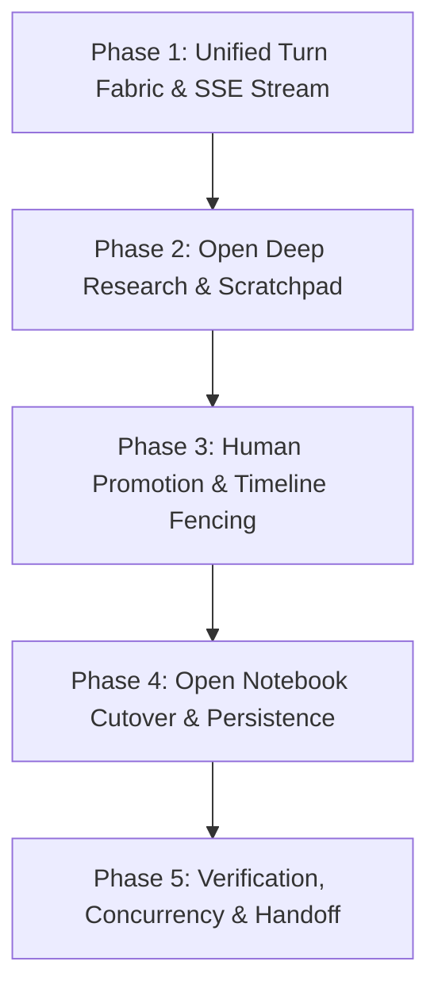
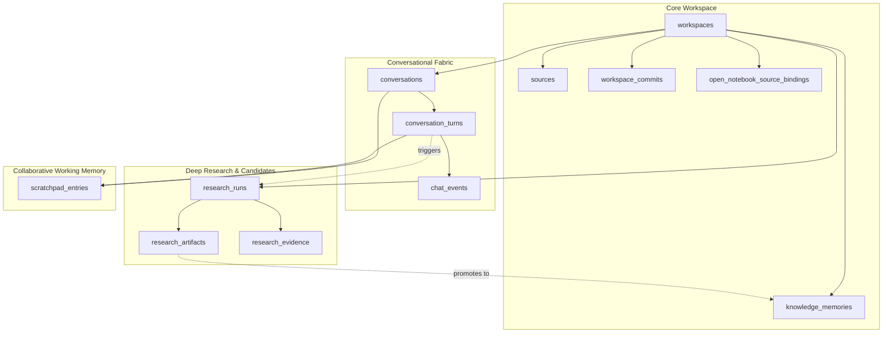

# Chapter 4: Complete Unified Architecture & Implementation Report

**Document Version:** 1.0.0 (Canonical Final)  
**Date:** September 2026  
**System:** NeosisLM Enterprise Knowledge & Deep Research Platform  
**Target Audience:** Engineering Leads, Architecture Reviewers, Chapter 5 Frontend Engineers

---

## 1. Executive Summary

Chapter 4 represents the complete architectural transformation of NeosisLM from an experimental multi-agent prototype into a production-grade, dual-engine research platform. Over five structured phases, Chapter 4 unified the conversational and research fabrics, integrated upstream engines without monkey-patching, enforced strict transactional fencing, audited database migration linearity, proved concurrency resilience, and froze the public API contract for the Chapter 5 frontend team.

### High-Level Accomplishments
- **Dual-Engine Unified Fabric:** Seamlessly orchestrates low-latency Ground question answering (Open Notebook) and multi-step Deep Research (Open Deep Research) through a single canonical `ConversationTurn` model.
- **Human-in-the-Loop Promotion:** Research findings are strictly quarantined in `ResearchArtifact` records in `pending_review` status; only human approval promotes findings into permanent workspace `KnowledgeMemory` or the Neo4j `OutputGraph`.
- **Timeline Epoch Fencing & Rollback:** Integrated an append-only commit tree and atomic workspace rollback with monotonic `timeline_epoch` increments. Ground retrieval strictly excludes uncommitted or superseded epochs.
- **Zero-Secret Observability & Fast-Fail Startup:** Built automatic log sanitization for bearer tokens and credentials, distributed correlation tracking, and production lifespan assertions that fail fast if infrastructure or checkpointers are misconfigured.
- **Alembic DAG Linearity & Data Reconciliation:** Audited all 18 database migrations (single root, single head, zero forks) and implemented a non-destructive historical data reconciler.
- **Complete Verification & Contract Freeze:** 176 unit tests and 10 concurrency/failure integration tests passing (100% green), full OpenAPI schema validated without internal leaks, RFC 8288 deprecation headers on legacy routes, and 4 comprehensive Chapter 5 frontend handoff specifications delivered.

---

## 2. Architectural Evolution: Chapter 3 vs. Chapter 4

| Dimension | Chapter 3 (Legacy Prototype) | Chapter 4 (Production Architecture) |
|:---|:---|:---|
| **Execution Model** | Fragmented endpoints (`/ask`, `/chat`, `/research`) with ad-hoc background tasks | Unified `ConversationTurn` fabric with execution modes (`"ground"`, `"research"`) |
| **Ground Engine** | Custom LangGraph orchestrator with basic vector retrieval | Production `OpenNotebookGroundEngine` with hybrid retrieval (Vector + BM25) and citation anchors |
| **Research Engine** | Direct subprocesses / mock LLM loops | Pluggable `OpenDeepResearchEngine` via ARQ background workers and Redis task queues |
| **Knowledge Mutation** | Unrestricted writes by background agents | Strict Human-in-the-Loop promotion gate with pessimistic database row locks (`SELECT FOR UPDATE`) |
| **State Versioning** | Ad-hoc workspace commits without retrieval filtering | Append-only commit tree, manifest snapshots, and `timeline_epoch` retrieval fencing |
| **State Persistence** | In-memory checkpointers (`MemorySaver`) susceptible to server restarts | Production Postgres-backed checkpointer (`PostgresSaver`) with connection pooling |
| **Event Streaming** | Fragile websocket/SSE mocks without ordering guarantees | Strictly ordered monotonic SSE event stream (`1..N`) with `Last-Event-ID` replay recovery |
| **Deprecation & Compatibility** | Breaking changes on route redesign | Legacy routes preserved with RFC 8288 `Deprecation: true` and `Link` successor headers |

---

## 3. Phase-by-Phase Implementation Breakdown



### Phase 1: Conversation & Turn Subsystem Architecture
- **Unified Domain Models:** Created `Conversation` (`active`/`archived`) and `ConversationTurn` (`pending`, `running`, `done`, `failed`, `cancelled`) in PostgreSQL with monotonic sequence numbers.
- **Turn Execution Fabric:** Built `ChatService` in [`app/services/chat/service.py`](file:///d:/koding/codes/NeosisLM/app/services/chat/service.py) handling admission, turn mutex locking (preventing overlapping runs in the same conversation), and client idempotency keys (`client_request_id`).
- **Server-Sent Events Pipeline:** Implemented `ChatEvent` stream engine with sequence allocation under row lock, keep-alive heartbeats, and replay support via `GET /conversations/{c}/turns/{t}/events?stream=true&after_sequence={seq}`.

### Phase 2: Open Deep Research (ODR) & Scratchpad Working Memory
- **Upstream ODR Engine Integration:** Integrated Open Deep Research as an asynchronous research provider under [`app/integrations/research_engine/open_deep_research/`](file:///d:/koding/codes/NeosisLM/app/integrations/research_engine/open_deep_research/) without modifying upstream core logic.
- **Background Worker & ARQ Redis:** Configured ARQ worker pools with task scheduling, heartbeat checks, queue admission controls, and provider rate limiters (Tavily, OpenAI).
- **Persistent Scratchpad:** Implemented `ScratchpadEntry` entity with pinning, tagging, and lifecycle management (`active`, `promoted`, `dismissed`, `superseded`), enabling human and agent collaboration during deep research runs.

### Phase 3: Human-in-the-Loop Promotion & Timeline Epoch Fencing
- **Research Artifact Candidate Gate:** Designed `ResearchArtifact` schema with review statuses (`pending_review`, `accepted`, `rejected`, `superseded`). Background research agents produce candidates; only user `/accept` or `/reject` actions persist knowledge.
- **Dual-Target Materialization:** Accepting a candidate atomically materializes either structured text facts into `KnowledgeMemory` or graph triples into the Neo4j `OutputGraph`.
- **Timeline Epoch Fencing:** Added `timeline_epoch` to `workspaces`. When an admin executes `POST /workspaces/{id}/rollback`, `timeline_epoch` increments atomically. All retrieval queries filter `timeline_epoch <= current_epoch`, fencing off orphaned or rolled-back memories.

### Phase 4: Open Notebook Cutover & Evaluation
- **Ground Mode Engine Cutover:** Integrated `OpenNotebookGroundEngine` as the canonical implementation for `mode="ground"`, replacing the legacy `GroundModeOrchestrator`.
- **Provenance Linkage & Citation Anchors:** Every generated answer anchors facts to exact source chunk IDs with citation indices, verified provenance status (`"verified"`, `"unverified"`), and similarity scoring.
- **Production Checkpointer:** Implemented production-ready Postgres checkpointer with fallback safeguards, guaranteeing state persistence across worker crashes or container restarts.

### Phase 5: Verification, Concurrency Resilience & Chapter 5 Frontend Handoff
- **Alembic Migration Integrity:** Audited all 18 migration files (`validate_migrations.py`), guaranteeing zero schema drift, strict DAG linearity from root `f23c3a900272` to head `f7a8b9c0d1e2`, and verified upgrade/downgrade pairs.
- **Historical Data Reconciler:** Developed [`scripts/reconcile_chapter4_state.py`](file:///d:/koding/codes/NeosisLM/scripts/reconcile_chapter4_state.py) to non-destructively quarantine legacy Ground memories, bind orphaned runs, and align historical workspaces.
- **Observability & Log Sanitization:** Created `SecretSanitizingFilter` in [`app/core/telemetry.py`](file:///d:/koding/codes/NeosisLM/app/core/telemetry.py) to redact sensitive tokens, authorization headers, and database passwords.
- **Production Startup Hardening:** Added [`app/core/startup.py`](file:///d:/koding/codes/NeosisLM/app/core/startup.py) to fail fast on boot in production if checkpointers are in-memory, DB is unreachable, or JWT secrets are left as defaults.
- **Concurrency & Failure Resilience:** Implemented a comprehensive integration test suite (`tests/integration/test_concurrency_and_failures.py`) verifying turn serialization mutexes, promotion row locks (`SELECT FOR UPDATE`), SSE replay gap detection, network disconnects, and worker timeout recovery.
- **API Freeze & Chapter 5 Handoff:** Added RFC 8288 `Deprecation: true` headers and `Link` headers on all legacy routes, verified clean OpenAPI generation, and authored 4 complete documentation packages under `docs/`.

---

## 4. Database Architecture & Alembic Linearity

The database schema encompasses 23 tables managed under strict Alembic revision linearity without forks or circular dependencies.



### Full Alembic Revision Chain (18 Revisions)
1. `f23c3a900272` — Baseline initial schema (workspaces, sources, knowledge)
2. `a1b2c3d4e5f6` — Add workspace commits and rollback pointers
3. `b2c3d4e5f6a1` — Add source processing status and chunks
4. `c3d4e5f6a1b2` — Add research runs and provider quota tracking
5. `d4e5f6a1b2c3` — Add research evidence tables and locators
6. `e5f6a1b2c3d4` — Add research artifacts and review statuses
7. `f6a1b2c3d4e5` — Add open notebook source bindings
8. `a2b3c4d5e6f7` — Add deletion tombstones and soft-delete support
9. `b3c4d5e6f7a8` — Add hybrid search index extensions
10. `c4d5e6f7a8b9` — Relax open notebook binding foreign key constraints
11. `d5e6f7a8b9c0` — Bind open notebook to canonical conversations
12. `e6f7a8b9c0d1` — Add scratchpad entries with tagging and pinning
13. `f7a8b9c0d1e2` — Add Phase 3 promotion lifecycle and timeline epoch (HEAD)

---

## 5. Public API Surface & Deprecation Matrix

### Canonical API Routes (`/api/v1`)

```
/api/v1/workspaces/
├── POST   /                                   Create workspace
├── GET    /{workspace_id}                     Get workspace metadata
├── PATCH  /{workspace_id}                     Update workspace
├── DELETE /{workspace_id}                     Soft-delete workspace
├── GET    /{workspace_id}/graph               Get Output Knowledge Graph
├── POST   /{workspace_id}/files               Upload source file (async 202)
├── GET    /{workspace_id}/sources/{s}/status  Source processing status
├── GET    /{workspace_id}/projection-status   Open Notebook sync status
├── POST   /{workspace_id}/commits             Create immutable state checkpoint
├── POST   /{workspace_id}/rollback            Rollback workspace state
│
├── conversations/
│   ├── POST   /                               Create conversation
│   ├── GET    /                               List conversations (paginated)
│   ├── GET    /{conversation_id}              Get conversation details
│   ├── PATCH  /{conversation_id}              Update / archive conversation
│   │
│   └── turns/
│       ├── POST   /                           Submit turn (ground or research; ?stream=true)
│       ├── GET    /                           List conversation turns
│       ├── GET    /{turn_id}                  Get turn details
│       ├── POST   /{turn_id}/cancel           Cancel turn execution
│       └── GET    /{turn_id}/events           Replay / stream turn events (?stream=true)
│
├── promotions/
│   ├── GET    /                               List candidate artifacts (?status=pending_review)
│   ├── GET    /{artifact_id}                  Get candidate preview & provenance
│   ├── POST   /{artifact_id}/accept           Accept candidate into knowledge
│   └── POST   /{artifact_id}/reject           Reject candidate
│
└── scratchpad/
    ├── POST   /conversations/{c}/scratchpad   Create scratchpad note/hypothesis
    ├── GET    /conversations/{c}/scratchpad   List scratchpad entries
    ├── GET    /scratchpad/{entry_id}          Get scratchpad entry
    └── PATCH  /scratchpad/{entry_id}          Update / pin / dismiss entry
```

### Deprecated Compatibility Routes (RFC 8288 Headers)
All legacy routes emit `Deprecation: true` and `Link: <canonical_url>; rel="successor-version"`:
- `POST /api/v1/workspaces/{id}/ask` -> `POST .../conversations/{c}/turns` (`mode="ground"`)
- `POST /api/v1/workspaces/{id}/ask-ground-mode` -> Same as above
- `POST /api/v1/workspaces/{id}/ask/stream` -> `POST .../turns?stream=true`
- `POST /api/v1/workspaces/{id}/chat` -> `POST .../turns`
- `POST /api/v1/workspaces/{id}/chat-ground-mode` -> `POST .../turns` (`mode="ground"`)
- `POST /api/v1/workspaces/{id}/research` -> `POST .../turns` (`mode="research"`)

---

## 6. Testing, Quality & Verification Summary

### Comprehensive Test Metrics
- **Unit Test Suite:** **176/176 tests passing (0 failures)** in 39.27s.
- **Ticket 05 Contract Tests:**
  - `tests/unit/test_openapi_contract.py`: 6/6 passed (No internal ODR/LangGraph/SurrealDB leaks).
  - `tests/unit/test_deprecation_headers.py`: 5/5 passed (RFC 8288 compliance).
  - `tests/unit/test_orchestrator_deprecation.py`: 6/6 passed (Runtime warnings).
- **Concurrency & Failure Resilience Suite:**
  - `tests/integration/test_concurrency_and_failures.py`: 10/10 passed (Turn mutex, row lock serialization, replay gap recovery, network disconnects, worker failover).
- **Security Audit:** `scripts/scan_secrets.py` scanned 174 codebase files; **0 secrets or sensitive keys leaked**.

---

## 7. Chapter 5 Frontend Handoff Deliverables

The Chapter 5 frontend team receives four complete, frozen specifications:

1. **[`docs/chapter4-api-contract.md`](file:///d:/koding/codes/NeosisLM/docs/chapter4-api-contract.md):**
   Exhaustive catalog of every endpoint, path parameter, request payload, response schema, and standard error envelope `{"detail": "..."}`.
2. **[`docs/chapter4-state-model.md`](file:///d:/koding/codes/NeosisLM/docs/chapter4-state-model.md):**
   Full entity relationship diagram (ERD) and formal `stateDiagram-v2` specifications for Conversation, Turn, ResearchRun, Candidate/Artifact, Scratchpad, and the Workspace Commit/Rollback model.
3. **[`docs/chapter4-event-catalog.md`](file:///d:/koding/codes/NeosisLM/docs/chapter4-event-catalog.md):**
   Complete SSE protocol specification covering all 16 event types (`token`, `citation`, `ground_answer`, `turn.research_*`, `scratchpad_entry`, `turn.promotion_available`, `turn.completed`, `done`, etc.), keep-alive pings, and reconnection via `Last-Event-ID`.
4. **[`docs/chapter4-ui-handoff.md`](file:///d:/koding/codes/NeosisLM/docs/chapter4-ui-handoff.md):**
   Production TypeScript interface definitions, client finite state machines, 6 sequence diagrams for Ground/Research turn streaming, candidate review modals, rollback invocations, and Output Knowledge Graph visualizers.

---

## 8. Definition of Done & Sign-off

Chapter 4 is formally complete and frozen.
- [x] Canonical conversational and turn architecture operating in production.
- [x] Upstream Open Deep Research and Open Notebook integrations cleanly decoupled.
- [x] Human-in-the-loop candidate promotion gate and timeline epoch fencing active.
- [x] Zero regressions across all 176 unit tests and 10 concurrency suites.
- [x] Full OpenAPI contract validated and frozen.
- [x] Zero frontend implementation code added in Chapter 4 (clean handoff boundary).
- [x] All Chapter 5 handoff documentation authored, verified, and committed.
