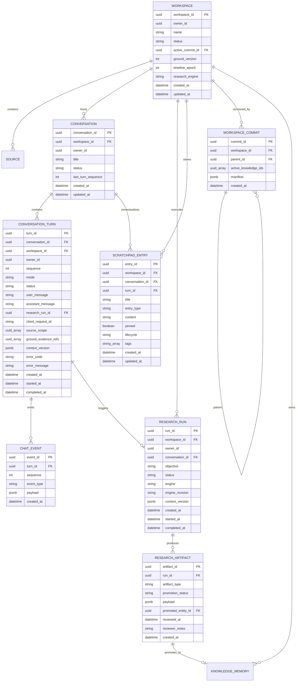
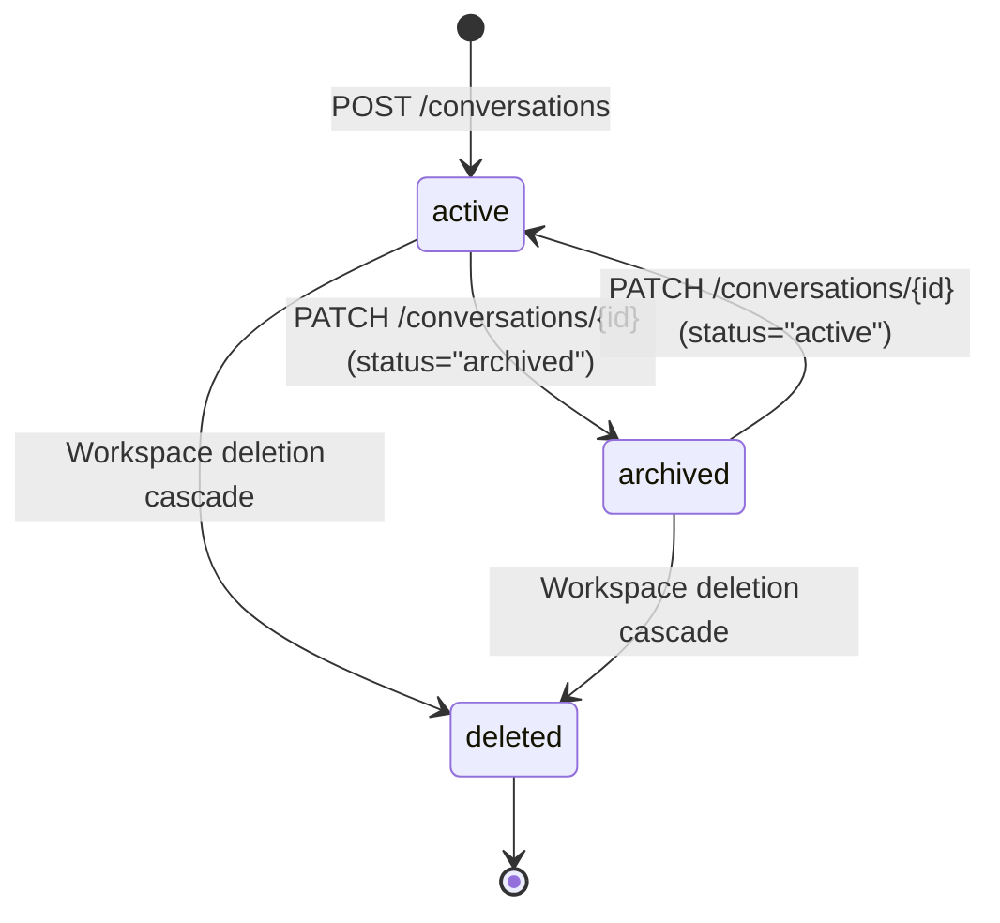
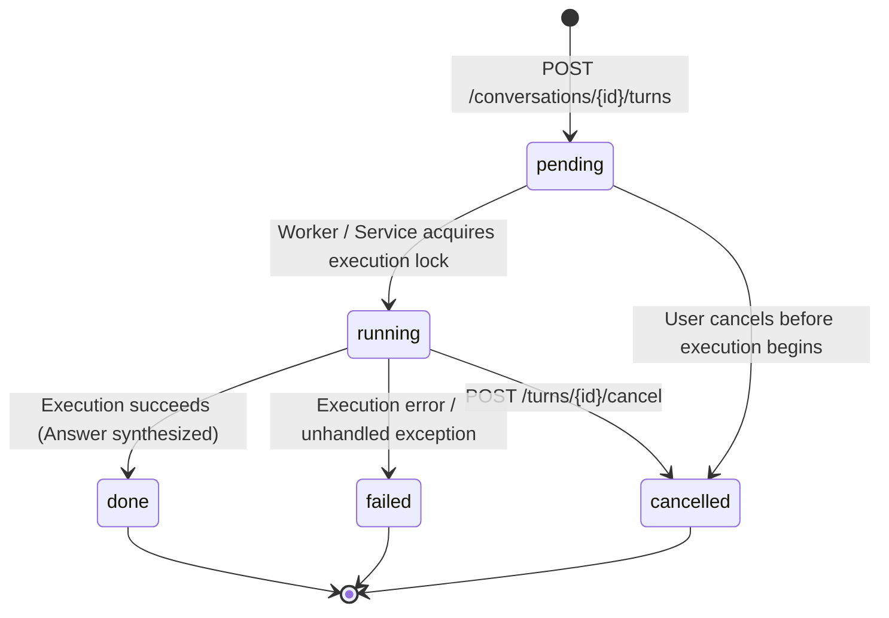
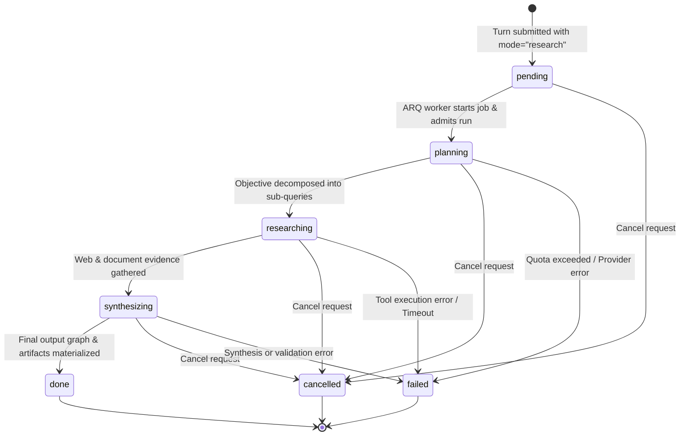
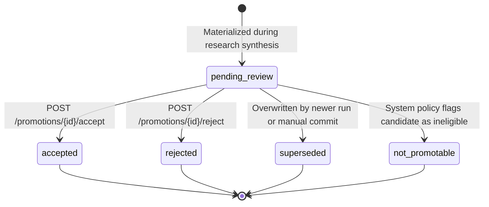
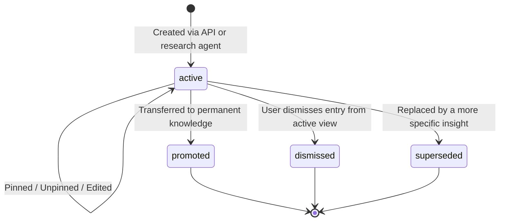
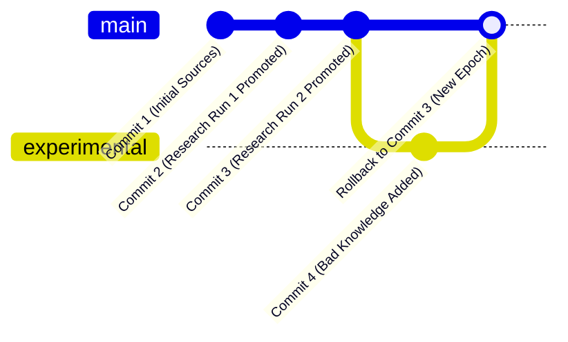

# Chapter 4: Domain State Model & Lifecycle Transitions

**Version:** 1.0.0 (Frozen)  
**Status:** Canonical  
**Audience:** Chapter 5 Frontend Engineers, State Machine Implementers, QA Engineers

---

## 1. Entity-Relationship Model (ERD)

The following Mermaid diagram captures the relational and ownership boundaries between Workspace, Sources, Conversations, Turns, Research Runs, Candidates, Scratchpad Entries, and Commits.

---

## 2. Conversation Lifecycle

Conversations provide continuous conversational context. A workspace may have multiple conversations, but each conversation belongs to exactly one workspace.

### Transition Invariants
- `last_turn_sequence` starts at `0` and is monotonically incremented under row lock (`SELECT FOR UPDATE`) on each turn creation.
- An archived conversation rejects new turn submissions with `HTTP 400 Bad Request`.
- Conversations never delete turns on status change.

---

## 3. Conversation Turn Lifecycle

A turn represents a single user query and assistant response cycle. Turns can run in either `"ground"` or `"research"` mode.

### Transition Invariants & Guard Rails
1. **Concurrency Lock:** At most one turn per conversation can be in `running` status at any time. Submitting a new turn while a turn is `running` returns `HTTP 409 Conflict`.
2. **Idempotency:** If `client_request_id` is supplied and matches an existing turn in the same conversation, the server returns the existing turn immediately without re-executing.
3. **Event Sequencing:** Every `ChatEvent` emitted during turn execution receives a strictly increasing, contiguous `sequence` number starting at `1`.
4. **Terminal States:** `done`, `failed`, and `cancelled` are terminal. No further events may be appended to a turn once it enters a terminal state.

---

## 4. Research Run Lifecycle

A `ResearchRun` represents the asynchronous multi-step execution conducted by Open Deep Research (ODR) or other pluggable engines.

### State Definitions
- `pending`: Enqueued in Redis ARQ queue waiting for an available worker slot.
- `planning`: Generating query decomposition and research plan. Emits `turn.research_planning`.
- `researching`: Executing parallel web searches, reading documents, scraping. Emits `turn.researching`.
- `synthesizing`: Compiling findings into an `OutputGraph` and candidate `ResearchArtifact` records. Emits `turn.synthesizing`.
- `done`: Terminal success. Emits `turn.completed`.
- `failed`: Terminal failure. Emits `turn.failed` with error code.
- `cancelled`: Terminal cancellation. Emits `turn.cancelled`.

---

## 5. Research Artifact & Promotion Candidate Lifecycle

Research runs do not write directly into canonical workspace knowledge. Instead, they materialize `ResearchArtifact` records in `pending_review` status. A human reviewer must explicitly accept or reject each candidate.

### Concurrency and Mutex Semantics
- Review actions (`/accept` and `/reject`) execute under pessimistic database row lock (`SELECT FOR UPDATE` on `research_artifacts`).
- Concurrent review requests for the same candidate are serialized; subsequent requests encounter terminal status (`accepted` or `rejected`) and return `HTTP 409 Conflict`.
- Upon `accepted`, the entity is atomically materialized into `KnowledgeMemory` (or Neo4j `OutputGraph`) and `promoted_entity_id` is recorded.
- Rejection preserves the candidate record for auditability without mutating workspace memory.

---

## 6. Scratchpad Entry Lifecycle

The scratchpad is a collaborative, persistent working buffer for intermediate research findings, hypotheses, and insights.

### Lifecycle Semantics
- `active`: Displayed on the conversation sidebar or scratchpad drawer. Supports live user edits.
- `promoted`: Marked as promoted after the user or agent copies it to workspace knowledge.
- `dismissed`: Hidden from default view but accessible via `?lifecycle=dismissed` filter.
- `superseded`: Automatically deprecated when a higher-fidelity hypothesis replaces it.

---

## 7. Workspace Commit & Rollback Model

NeosisLM employs an append-only, immutable commit graph for workspace state management.

### State & Epoch Rules
1. **Commit Immutability:** Once written, a `WorkspaceCommit` and its `manifest` JSON are completely immutable.
2. **Active Commit Pointer:** `workspaces.active_commit_id` points to the current active head commit.
3. **Atomic Rollback:** Invoking `POST /rollback` performs the following atomic operations under workspace row lock:
   - Verifies the target commit exists and belongs to the workspace.
   - Sets `workspace.active_commit_id = target_commit_id`.
   - Increments `workspace.timeline_epoch = workspace.timeline_epoch + 1`.
   - Returns the updated workspace.
4. **Epoch Quarantine:** Any knowledge memories or artifacts created with a `timeline_epoch` greater than the rollback epoch or not present in the target commit's manifest are excluded from Ground retrieval queries, preventing stale or reverted knowledge from leaking into active answers.
