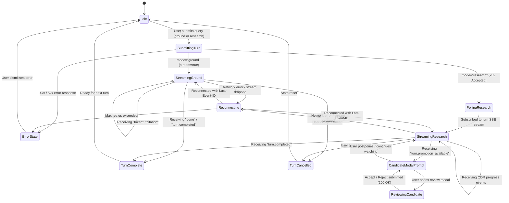
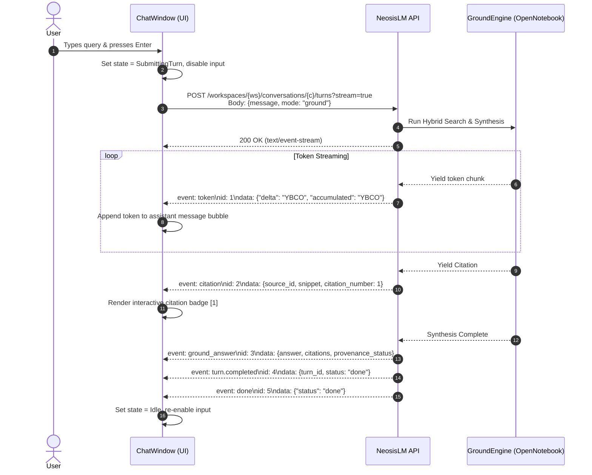
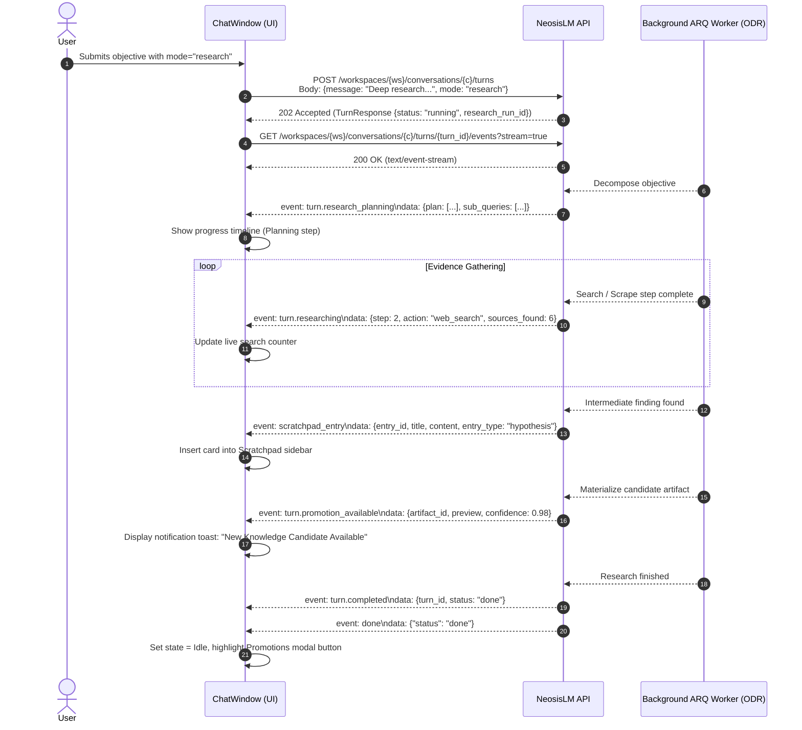
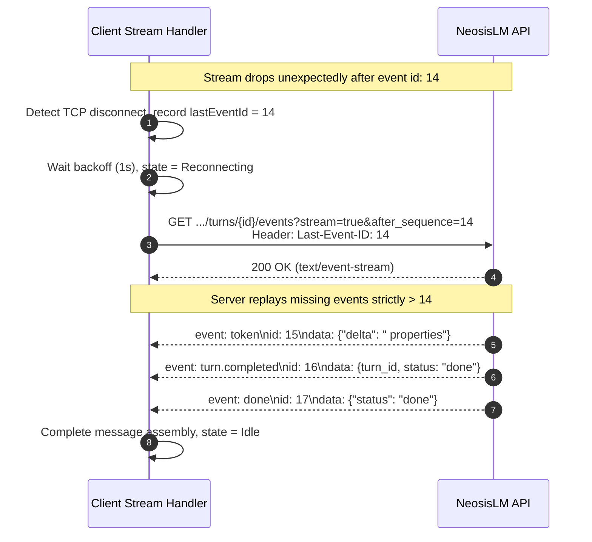
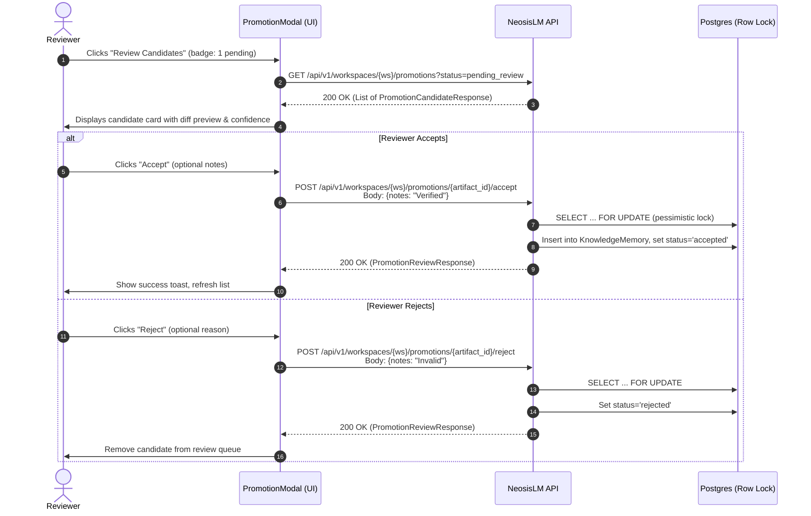
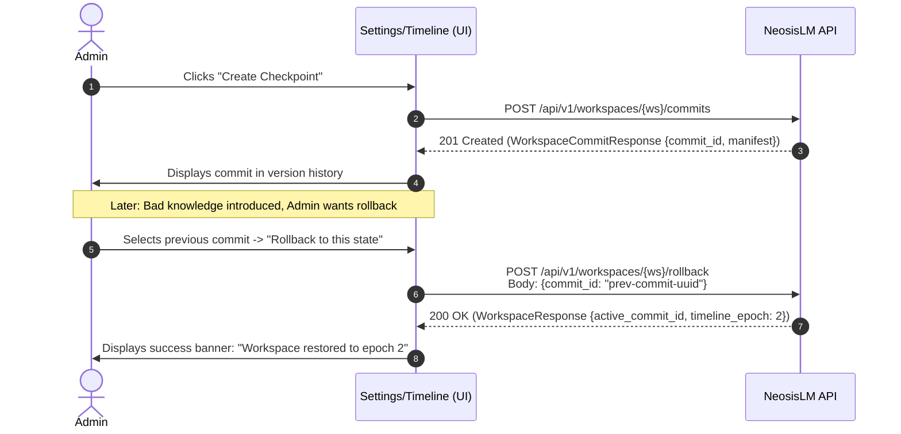
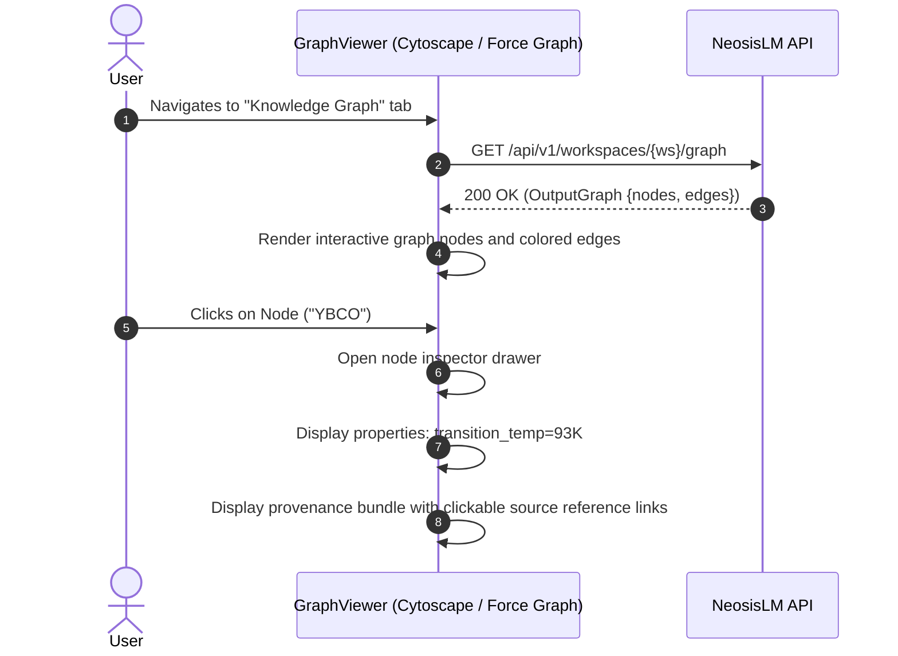

# Chapter 4: Frontend UI Handoff Specification (Chapter 5 Bridge)

**Version:** 1.0.0 (Frozen)  
**Status:** Canonical  
**Target:** Chapter 5 Frontend Engineers (React, Next.js, TypeScript)  
**Scope:** Complete TypeScript Type Definitions, UI Client State Machines, Sequence Diagrams, and Integration Recipes.

---

## 1. Concrete TypeScript Type Declarations

The following type definitions map 1:1 with the canonical Pydantic schemas exposed by the NeosisLM Chapter 4 API.

```typescript
// ==========================================
// Identifiers & Primitives
// ==========================================
export type UUID = string;
export type ISO8601Timestamp = string;

// ==========================================
// Workspace Models
// ==========================================
export type WorkspaceStatus = 'active' | 'archived' | 'deleted';
export type ResearchEngineType = 'open_deep_research' | 'mock';

export interface WorkspaceResponse {
  workspace_id: UUID;
  name: string;
  description?: string | null;
  owner_id: UUID;
  status: WorkspaceStatus;
  active_commit_id?: UUID | null;
  ground_version: number;
  timeline_epoch: number;
  research_engine: ResearchEngineType;
  created_at: ISO8601Timestamp;
  updated_at: ISO8601Timestamp;
}

export interface WorkspaceCreate {
  name: string;
  description?: string | null;
  research_engine?: ResearchEngineType;
}

export interface WorkspaceUpdate {
  name?: string | null;
  description?: string | null;
  research_engine?: ResearchEngineType | null;
}

export interface WorkspaceCommitManifest {
  schema_version: number;
  active_knowledge_ids: UUID[];
  accepted_artifact_ids: UUID[];
  output_graph_version: string;
  active_hypothesis_ids: UUID[];
  scratchpad_checkpoint?: {
    active_entries_count: number;
  };
  conversation_checkpoint?: {
    snapshot_at: ISO8601Timestamp;
  };
  base_research_run_ids: UUID[];
}

export interface WorkspaceCommitResponse {
  commit_id: UUID;
  workspace_id: UUID;
  parent_id?: UUID | null;
  manifest: WorkspaceCommitManifest;
  created_at: ISO8601Timestamp;
}

export interface RollbackRequest {
  commit_id: UUID;
}

// ==========================================
// Conversation & Turn Models
// ==========================================
export type ConversationStatus = 'active' | 'archived';
export type TurnMode = 'ground' | 'research';
export type TurnStatus = 'pending' | 'running' | 'completed' | 'failed' | 'cancelled' | 'aborted_by_timeline_fence';


export interface ConversationResponse {
  conversation_id: UUID;
  workspace_id: UUID;
  owner_id: UUID;
  title: string;
  status: ConversationStatus;
  last_turn_sequence: number;
  created_at: ISO8601Timestamp;
  updated_at: ISO8601Timestamp;
}

export interface ConversationCreate {
  title: string;
  mode?: string;
}

export interface ConversationUpdate {
  title?: string | null;
  status?: ConversationStatus | null;
}

export interface ConversationListResponse {
  conversations: ConversationResponse[];
  total: number;
  limit: number;
  offset: number;
}

export interface TurnCreate {
  message: string;
  mode: TurnMode;
  client_request_id?: string | null;
  source_scope?: UUID[] | null;
  selected_source_ids?: UUID[] | null;
  research_options?: {
    engine?: string;
    engine_revision?: string;
    max_iterations?: number;
    [key: string]: unknown;
  } | null;
}

export interface TurnResponse {
  turn_id: UUID;
  conversation_id: UUID;
  sequence: number;
  mode: TurnMode;
  status: TurnStatus;
  user_message: string;
  assistant_message?: string | null;
  research_run_id?: UUID | null;
  client_request_id?: string | null;
  source_scope?: UUID[] | null;
  ground_evidence_refs?: UUID[] | null;
  context_version: {
    ground_version?: number;
    timeline_epoch?: number;
    [key: string]: unknown;
  };
  error_code?: string | null;
  error_message?: string | null;
  created_at: ISO8601Timestamp;
  started_at?: ISO8601Timestamp | null;
  completed_at?: ISO8601Timestamp | null;
}

export interface TurnListResponse {
  turns: TurnResponse[];
  total: number;
}

// ==========================================
// Chat Event & Streaming Models
// ==========================================
export type ChatEventType =
  | 'token'
  | 'citation'
  | 'ground_answer'
  | 'turn.research_started'
  | 'turn.research_planning'
  | 'turn.researching'
  | 'scratchpad_entry'
  | 'turn.synthesizing'
  | 'turn.promotion_available'
  | 'turn.completed'
  | 'turn.partial'
  | 'turn.cancelled'
  | 'turn.failed'
  | 'status_change'
  | 'done'
  | 'error';

export interface ChatEventResponse {
  event_id: UUID;
  turn_id: UUID;
  sequence: number;
  event_type: ChatEventType;
  payload: Record<string, unknown>;
  created_at: ISO8601Timestamp;
}

export interface ChatEventListResponse {
  events: ChatEventResponse[];
  total: number;
}

// ==========================================
// Candidate Promotion Models
// ==========================================
export type CandidateType = 'memory_candidate' | 'graph_candidate';

export type PromotionStatus =
  | 'pending_review'
  | 'accepted'
  | 'rejected'
  | 'superseded'
  | 'not_promotable';

export interface PromotionCandidateResponse {
  artifact_id: UUID;
  run_id: UUID;
  artifact_type: CandidateType;
  promotion_status: PromotionStatus;
  payload: Record<string, unknown>;
  created_at: ISO8601Timestamp;
}

export interface ResearchRunResponse {
  run_id: UUID;
  workspace_id: UUID;
  owner_id: UUID;
  objective: string;
  status: string;
  engine: string;
  engine_revision?: string | null;
  current_attempt_id?: UUID | null;
  conversation_id?: UUID | null;
  turn_id?: UUID | null;
  timeline_epoch: number;
  created_at: ISO8601Timestamp;
  updated_at: ISO8601Timestamp;
}

export interface PromotionReviewRequest {
  notes?: string;
}

export interface PromotionReviewResponse {
  artifact_id: UUID;
  promotion_status: PromotionStatus;
  promoted_entity_id?: UUID | null;
  reviewed_at: ISO8601Timestamp;
  reviewer_notes?: string | null;
}

// ==========================================
// Scratchpad Models
// ==========================================
export type ScratchpadLifecycle = 'active' | 'promoted' | 'dismissed' | 'superseded';
export type ScratchpadEntryType = 'hypothesis' | 'insight' | 'note' | 'citation';

export interface ScratchpadEntryCreate {
  title: string;
  entry_type: ScratchpadEntryType;
  content: string;
  pinned?: boolean;
  tags?: string[];
}

export interface ScratchpadEntryUpdate {
  title?: string;
  content?: string;
  pinned?: boolean;
  lifecycle?: ScratchpadLifecycle;
  tags?: string[];
}

export interface ScratchpadEntryResponse {
  entry_id: UUID;
  workspace_id: UUID;
  conversation_id: UUID;
  turn_id?: UUID | null;
  title: string;
  entry_type: ScratchpadEntryType;
  content: string;
  pinned: boolean;
  lifecycle: ScratchpadLifecycle;
  tags: string[];
  created_at: ISO8601Timestamp;
  updated_at: ISO8601Timestamp;
}

export interface ScratchpadEntryListResponse {
  entries: ScratchpadEntryResponse[];
  total: number;
}

// ==========================================
// Output Knowledge Graph Models
// ==========================================
export interface ProvenanceBundle {
  derived_from_refs: UUID[];
  calculation?: string | null;
  verification_status?: string | null;
}

export interface OutputGraphNode {
  id: string;
  label: string;
  properties: Record<string, unknown>;
  provenance?: ProvenanceBundle | null;
}

export interface OutputGraphEdge {
  source_id: string;
  target_id: string;
  type: string;
  properties: Record<string, unknown>;
}

export interface OutputGraph {
  nodes: OutputGraphNode[];
  edges: OutputGraphEdge[];
}
```

---

## 2. UI Client State Machine

The frontend UI client maintains a localized finite state machine to manage turn streaming, user input gating, and background polling.



---

## 3. End-to-End Sequence Diagrams

### 3.1 Scenario 1: Starting & Streaming a Ground Turn

Ground turns are optimized for fast response times. The client connects via SSE and streams tokens and citations directly to the chat window.



---

### 3.2 Scenario 2: Starting & Streaming a Research Turn

Research turns are long-running asynchronous workflows executed by background workers.



---

### 3.3 Scenario 3: Stream Disconnection & Reconnection

When network connectivity falters, the client recovers lost events without duplicate rendering.



---

### 3.4 Scenario 4: Human-in-the-Loop Candidate Review & Promotion



---

### 3.5 Scenario 5: Workspace Snapshot Commit & Rollback



---

### 3.6 Scenario 6: Visualizing the Output Knowledge Graph



---

## 4. Frontend Implementation Recipes & Best Practices

1. **SSE Client Library:** Use native `EventSource` with the `fetch-event-source` polyfill (from `@microsoft/fetch-event-source`) to support custom `Authorization: Bearer` headers and automatic reconnects with `Last-Event-ID`.
2. **Idempotency Keys:** For turn submission, generate a unique UUID v4 on the client as `client_request_id`. If the network times out during submission, safely retry with the same `client_request_id` to prevent duplicate turn creation.
3. **Turn Mutex Handling:** If the server returns `HTTP 409 Conflict` on `POST /turns`, a turn is currently in flight. Check `GET /turns` to locate the running turn and subscribe to its event stream.
4. **Citation Badges:** Render citations inline using superscript buttons (`[1]`). On click or hover, open a popover containing the source excerpt snippet and file link.
5. **No Frontend Code in Chapter 4:** This document serves as the formal handoff bridge into Chapter 5. Chapter 5 will implement the UI components based strictly on these types and contracts.
