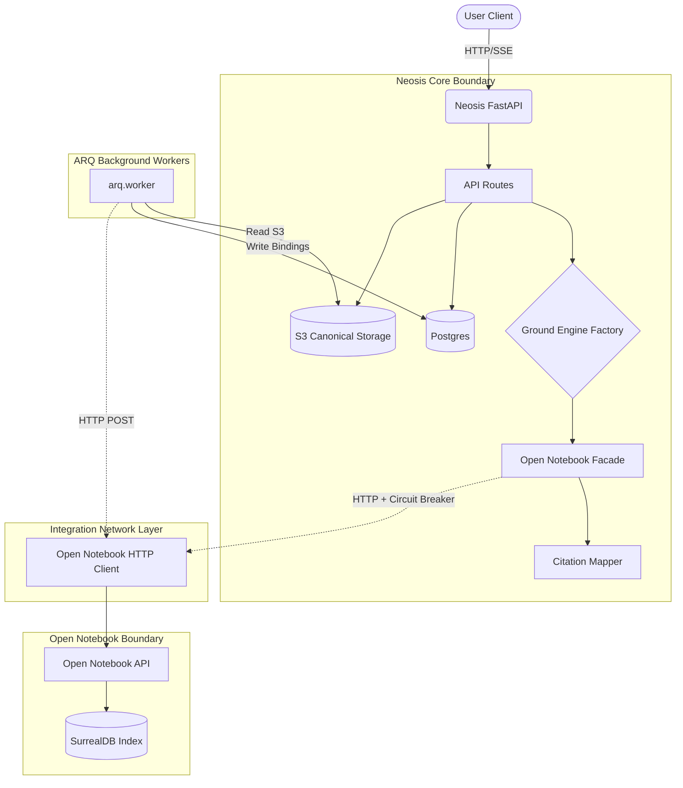

# Open Notebook Ground Integration: Architecture & Operations Guide

This document serves as the authoritative, deep-dive technical reference for the **Open Notebook Ground Engine Integration** (Chapter 2). It is written for senior engineers, operators, and maintainers who need to understand the structural boundaries, data propagation patterns, specific mechanics of ingestion, and the operational telemetry used to safely couple NeosisLM to the isolated Open Notebook microservice.

---

## 1. Architectural Philosophy and Design Tenets

Integrating an external LLM-driven retrieval system requires extreme caution to prevent data leaks, state drift, and cascading failures. We adhere strictly to these tenets:

1. **Neosis Owns the Product Boundary:** Neosis is the absolute canonical source of truth for Users, Workspaces, Sources, RBAC permissions, and Chat History. Open Notebook is strictly an *implementation detail* of the `Ground` mode. 
2. **Anti-Corruption Layer (ACL):** Open Notebook operates via `SurrealDB` and its own internal ID schemas (`source:12xyz`). These foreign IDs **never** bleed into the Neosis frontend or core tables. The integration layer intercepts and translates all identifiers, maintaining UUID-v4 purity on the Neosis side.
3. **Data Projection over Delegation:** Neosis does not blindly forward incoming file bytes to Open Notebook. It stores a canonical snapshot in S3 first, and then asynchronously *projects* a copy to Open Notebook for indexing. This makes Neosis fully reproducible and allows us to rebuild Open Notebook from scratch if it suffers data corruption.
4. **Defensive Operations:** The Open Notebook upstream is treated as inherently unstable. We use connection pooling, circuit breakers, back-pressure delays, and explicitly mapped HTTP exceptions (like 409 Session Lost) to shield Neosis.

### High-Level Topology

---

## 2. Ingestion Mechanics: How PDFs and URLs Work

A critical design requirement is that the frontend UI must not change. The UI continues to upload `multipart/form-data` PDFs or JSON URL payloads to Neosis as normal. Behind the scenes, the integration employs the **Asynchronous Source Projection Pattern**.

### Step-by-Step Flow: PDF/URL Ingestion

1. **Canonical Ingestion (`POST /sources`)**:
   - The user uploads a PDF or submits a URL via the UI.
   - Neosis accepts the request and immediately saves the raw file bytes to S3, generating a `checksum_sha256`.
   - Neosis creates a canonical `Source` record and a `SourceSnapshot` in Postgres.
   - Neosis then creates an `OpenNotebookSourceBinding` in the `PENDING` state.
   - Neosis responds immediately to the user with `202 Accepted`.

2. **The Hand-off to ARQ (`project_to_open_notebook_job`)**:
   - An ARQ background job is enqueued with the `snapshot_id`.
   - The ARQ worker wakes up, verifies the binding is still `PENDING`, and claims the job.
   - It downloads the raw bytes from S3 into a temporary memory file.

3. **Upstream Upload**:
   - The ARQ worker uses the `OpenNotebookClient` to push the file to the Open Notebook `/api/sources` endpoint.
   - Open Notebook chunks the document, embeds it, and stores it in SurrealDB.
   - Open Notebook returns its internal identifier (e.g., `source:8f9a2b`).

4. **Binding Completion**:
   - The ARQ worker writes `source:8f9a2b` into the Postgres `OpenNotebookSourceBinding` table and transitions the state to `ACTIVE`.
   - The workspace `ground_version` is incremented to bust downstream semantic caches.

### Integrating the UI

**As a frontend engineer, you don't need to learn Open Notebook.**
- To ingest a document, simply use `POST /api/v1/workspaces/{workspace_id}/sources` exactly as before.
- To check if a document is ready for queries, poll `GET /api/v1/sources/{source_id}`. The backend abstraction automatically computes the "readiness" of the source based on whether its Open Notebook binding has hit the `ACTIVE` state.
- Once the UI sees `status: "ready"`, the document is fully indexed and queryable.

---

## 3. Query Execution & SSE Normalization

When a user asks a question in Ground mode, the request routes through the `OpenNotebookGroundEngine`.

1. **Workspace Sync Check**: The engine verifies the `Workspace` exists and possesses an Open Notebook `notebook_id`.
2. **Ask Stream Trigger**: The engine invokes `ask_stream()` on the `OpenNotebookClient`.
3. **SSE Normalization**: 
   - Open Notebook emits raw Server-Sent Events with its own token schemas.
   - The `OpenNotebookClient` parses these events inline, stripping out Open Notebook specifics, and remaps them to the standard Neosis SSE contract (`event: strategy`, `event: answer`, `event: final_answer`).
4. **Citation Mapping (The Anti-Corruption Layer)**:
   - When Open Notebook emits its final answer, it includes references to documents using SurrealDB IDs (`source:123`, `source:456`).
   - The `CitationMapper` intercepts this payload. It queries Postgres: *"Which Neosis Source UUIDs have an active OpenNotebookSourceBinding matching `source:123`?"*
   - It replaces the SurrealDB IDs with proper Neosis UUIDs. The frontend receives an `evidence` array containing clean Neosis `source_id`s.
   - The UI then renders these citations by fetching the known Neosis metadata for those UUIDs.

---

## 4. Operational Guardrails & Edge Cases (ADR 0001)

Integrating with an opaque AI engine is dangerous. The following protective mechanics are explicitly coded:

### Connection Pooling (Lifespan Context)
`httpx.AsyncClient` is instantiated as a global singleton attached to the FastAPI `lifespan` context (in `app/main.py`), and injected into the factory via the HTTP request state. This maintains TCP keep-alive connections to Open Notebook. If we instantiated a new client per request, Neosis would quickly exhaust ephemeral ports under high concurrency.

### Cache Safety (Workspace Versioning)
We cannot rely on clock timestamps to invalidate query caches because distributed system clocks drift. Instead, the `Workspace` model includes a deterministic `ground_version` integer. Every time a source projection becomes `ACTIVE` or `DELETED`, this integer increments. The frontend or caching layers can append this `ground_version` to their cache keys to guarantee semantic freshness.

### Terminal Deletion State (`ORPHANED_UPSTREAM`)
When a user deletes a source in Neosis, it is deleted instantly from the Postgres schema. The actual cleanup in Open Notebook happens asynchronously via an ARQ tombstone worker. 
If Open Notebook crashes, the tombstone worker will retry. After 5 exponential backoff failures, the worker explicitly flags the tombstone as `ORPHANED_UPSTREAM`. This prevents the worker from infinitely hanging on a dead service, leaving an explicit audit trail for DBAs to run a manual reconciliation script.

### Session State Loss (`409 Conflict`)
If the Open Notebook container is restarted or its SurrealDB volume drops, it loses the transient conversational session memory. If Neosis attempts to query an active chat against a lost session, Open Notebook returns `404 Not Found`.
The `OpenNotebookClient` traps this specific 404 and translates it into an explicit `HTTPException(status_code=409, detail="session_state_lost")`. This prevents Neosis from silently rehydrating a blank context and hallucinating. The UI must catch this 409 and prompt the user to start a new chat.

---

## 5. Telemetry & Cross-Service Observability

To debug a failing query across isolated microservices, we enforce deterministic correlation:

1. **Context Initialization**: FastAPI middleware generates a `X-Neosis-Run-ID` per HTTP request.
2. **Context Passing**: `app/core/telemetry.py` stores this ID in a thread-safe `ContextVar`.
3. **Upstream Injection**: The `OpenNotebookClient` intercepts all outgoing requests to Open Notebook and injects the `X-Neosis-Run-ID` header.

### Troubleshooting Playbook

| Incident | Diagnosis | Remediation |
| :--- | :--- | :--- |
| **503 Service Unavailable on `/ask`** | The HTTP circuit breaker tripped due to consecutive upstream timeouts or connection resets. | Verify the Open Notebook Docker container is healthy and `OPEN_NOTEBOOK_BASE_URL` is correct. |
| **Silent Citation Loss** | The `evidence` array is empty but the text mentions documents. | Inspect `citation_mapper.py` logs. The background projection task may have failed to record the `OpenNotebookSourceBinding`, meaning the mapper cannot resolve the foreign ID back to a Neosis canonical UUID. |
| **"Unable to generate a grounded answer"** | Open Notebook successfully executed but found no semantic matches for the query. | Verify the source bindings are `ACTIVE`. If they are, the query is genuinely out of domain. |
| **500 Error in the UI** | A generic fault occurred downstream. | Grab the `X-Neosis-Run-ID` from the browser network tab. Grep the Neosis logs to find the circuit breaker state. Grep the Open Notebook Docker logs using that exact same Run ID to find the raw stack trace. |
| **Emergency Rollback Needed** | A critical upstream bug is discovered. | Change `OPEN_NOTEBOOK_ENABLED = False` in `app/core/config.py` and restart the workers. Traffic will instantly route back to the deprecated `GroundModeOrchestrator` without schema migrations. |
